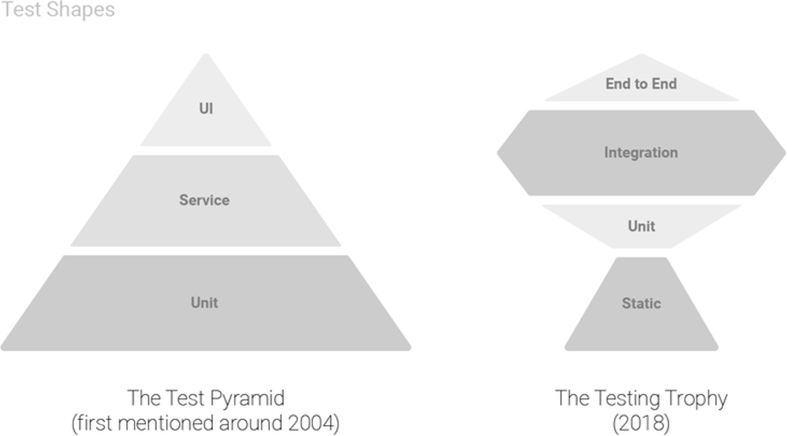

# A alternative to Page Object Models

[image](./assets/change-my-mind.jpg)

---
# Why Page Objects (Models)

1. Less brittle to changes in the UI
2. Provides a interface that's easy to program to
3. Your POMs represents actual user's mental model
4. It makes selectors reusable (keeps you DRY)
5. Hides implementation concerns


---

```js
class LoginPage {
    navigateTo() {
        cy.visit("/login");
    }

    enterUsername(username) {
        cy.get("input[name='user']").type(username); 
    }
    enterPassword(password) {
        cy.get("[data-testid='password']").type(password); 
    }
    submit() {
        cy.get(".submit").click();
    }
}
```

---

```js
  const LoginPage = require("./LoginPage");
  
  describe("Login", () => {
    let loginPage;
  
    beforeEach(() => {
      loginPage = new LoginPage();
    });
  
    it("should allow a user to log in", () => {
      loginPage.navigateTo();
      loginPage.enterUsername("user1");
      loginPage.enterPassword("password1");
      loginPage.submit();
    });
  });
```

---

# Costs
 - More code to maintain
 - Changes to implementation will effect your tests (even without functional changes) 
 - Selectors are abstracted away; another level of complexity
 - Learning curve (for new developers)
 - DX out of the box is bad; classes, using singletons, syncing state between driver and POM classes
 - Redefining your whole application (domain) in yet another structure

---

# Alternative?


---

POM hides my ugly queries
=> Improved test selectors/queries which utilize html semantics of a webpage

POM makes duplicating queries easy
=> E2e tests are integrated in development process and tests are covered on the appropiate level (testing pyramid)

POM makes my tests less brittle
=> Directly integrate test—setup with application and depend on stable api's


---

# Improved test selectors/queries which utilize html semantics of a webpage

There already is a builtin semantic API available in the browser which is used by screenreaders. Using this API to locate stuff on the screen will help you:

- Improve confidence; by resembling the way your users are using your applicaiton

- Improve accessibility; your first blind user is your test suite

- Hide implementations details like classnames, test-ids, specific CSS queries

---

```ts
describe("Login", () => {
  it("should allow a user to log in", () => {
    cy.visit("/login");

    // two example selectors which are using accessbility features
    cy.findByRole("textbox", { name: "username" }).type("user");
    
    // can be useful for repeating form elements
    cy.findByLabelText(/password/i).type("password"); 
    
    // asserts button contains Submit
    cy.findByRole("button", { name: /Submit/i }).click(); 
  });
});
```
---

# E2e tests are integrated in development process and tests are covered on the appropiate level (testing pyramid)


---


---
# Directly integrate test—setup with application and depend on stable api's

